# Ghostty Cursor Shaders — Preview Gallery

A collection of animated cursor shaders for the [Ghostty](https://ghostty.org)
terminal, with autoplaying previews of each one.

<p align="center">
  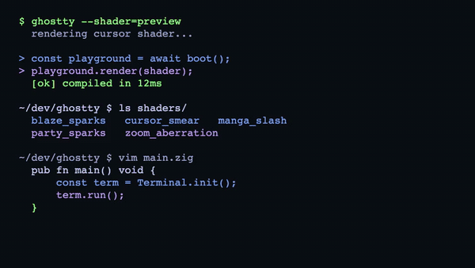
</p>
<p align="center"><sub><code>cursor_blaze</code> driven by <a href="demo.sh"><code>demo.sh</code></a></sub></p>

Every shader here has been verified to **compile and run** in WebGL2 (the
[ghostty-shader-playground](https://github.com/KroneCorylus/ghostty-shader-playground)),
so they're safe to drop straight into your Ghostty config.

```
github_output/
├── README.md          ← you are here
├── install.sh         ← installs shader(s) into your Ghostty config
├── demo.sh            ← makes the cursor dance, to show a shader off live
├── previews/          ← animated GIF preview of every shader
└── shaders/           ← the actual .glsl files, ready to use
```

> Previews are rendered with a generic terminal background and a scripted cursor
> path (typing, line jumps, and block↔bar shape changes). Over your real
> terminal content they'll look even better.

---

## Quick install (script)

The easiest way is [`install.sh`](install.sh) — works on **macOS and Linux**, and
runs from wherever you cloned the repo (it finds its own `shaders/` folder). Run
it with no arguments to pick shader(s), choose the animation mode, and confirm:

```sh
./install.sh
```

It copies the chosen shader(s) into your Ghostty config dir and writes a managed
`custom-shader` block for you.

> **`gum` is optional.** If [`gum`](https://github.com/charmbracelet/gum) is
> installed you get a fuzzy multi-select picker; otherwise it falls back to a
> plain numbered prompt. Install it for the nicer UI: `brew install gum` (macOS)
> or see [gum installation](https://github.com/charmbracelet/gum#installation).

You can also pass names directly to skip the picker, or script it:

```sh
./install.sh cursor_smear                 # install one
./install.sh cursor_blaze sparks          # chain several (applied in order)
./install.sh --animation always manga_slash
./install.sh --list                       # list available shaders
./install.sh --uninstall                  # remove the managed block
./install.sh --dry-run cursor_frozen      # preview changes without writing
./install.sh cursor_smear --yes           # skip the confirmation prompt
```

- The config file is auto-detected (`$XDG_CONFIG_HOME/ghostty/config`,
  `~/.config/ghostty/config`, or the macOS app-support path). Override with
  `--config <path>` or the `GHOSTTY_CONFIG` env var.
- Re-running **replaces** the managed block (no duplicates), and your existing
  config is backed up to `config.bak` first.
- After it runs, reload the Ghostty config (macOS: `⌘ + Shift + ,`) or restart.

## See it live (demo script)

After installing a shader and reloading Ghostty, run [`demo.sh`](demo.sh) to make
the cursor dance around the screen — typing, teleporting, and toggling
block↔bar — so you can watch every kind of effect fire:

```sh
./demo.sh            # loops until you press Ctrl-C
./demo.sh --once     # a single pass, then exit
./demo.sh --fast     # quicker movements   (also --slow)
```

It runs four scenes: a typing session (smear/blaze trails), a bouncing dance and
random teleports (long trails / sparks), and a block↔bar "mode storm" (ripple /
boom). Ctrl-C restores your normal cursor.

<p align="center">
  
</p>

## Manual install

1. Copy the shader you want from [`shaders/`](shaders/) into your Ghostty
   config directory, e.g.:

   ```sh
   mkdir -p ~/.config/ghostty/shaders
   cp shaders/cursor_smear.glsl ~/.config/ghostty/shaders/
   ```

   > Config dir is `~/.config/ghostty/` on Linux/macOS (or
   > `$XDG_CONFIG_HOME/ghostty/`). On macOS it may also be
   > `~/Library/Application Support/com.mitchellh.ghostty/`.

2. Add to your Ghostty `config` file:

   ```ini
   custom-shader = shaders/cursor_smear.glsl
   custom-shader-animation = true
   ```

   - `custom-shader` can be **repeated** to chain multiple shaders (they run in
     order). Paths are relative to the config file, or absolute.
   - `custom-shader-animation = true` is required so the cursor effects keep
     animating. Use `always` to keep them running even when the window is
     unfocused.

3. Reload the config (default macOS keybind `⌘ + Shift + ,`, or restart
   Ghostty).

These are Shadertoy-style fragment shaders that use Ghostty's cursor uniforms
(`iCurrentCursor`, `iPreviousCursor`, `iTimeCursorChange`, `iCurrentCursorColor`,
`iTime`, `iResolution`, `iChannel0`).

---

## Previews

### Smear / Trail

| Preview | Shader |
| --- | --- |
| 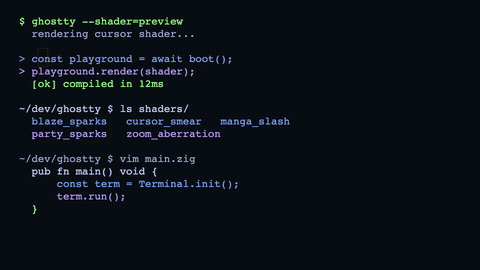 | **cursor_smear** — Classic smooth ink-smear that stretches from the old position to the new one.<br>[`shaders/cursor_smear.glsl`](shaders/cursor_smear.glsl) |
| 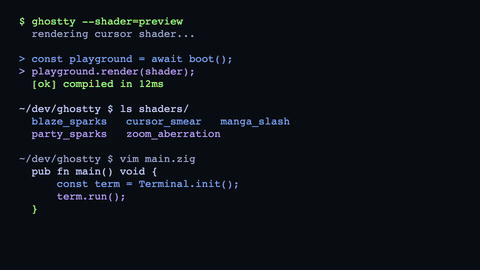 | **cursor_smear_fade** — Smear that fades out along its length.<br>[`shaders/cursor_smear_fade.glsl`](shaders/cursor_smear_fade.glsl) |
| 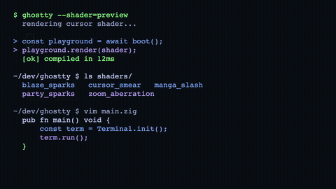 | **cursor_smear_gradient** — Smear with a color gradient down the trail.<br>[`shaders/cursor_smear_gradient.glsl`](shaders/cursor_smear_gradient.glsl) |
|  | **cursor_smear_rainbow** — Smear cycling through rainbow colors.<br>[`shaders/cursor_smear_rainbow.glsl`](shaders/cursor_smear_rainbow.glsl) |
| 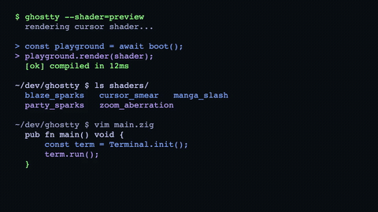 | **cursor_tail** — Comet-like tail that follows the cursor.<br>[`shaders/cursor_tail.glsl`](shaders/cursor_tail.glsl) |
| 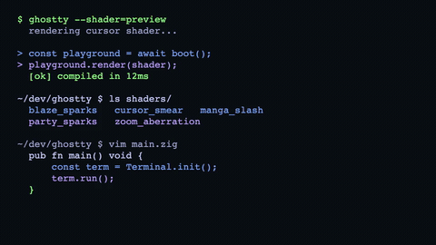 | **cursor_sweep** — Sweeping trail tinted with your cursor color (sRGB-correct).<br>[`shaders/cursor_sweep.glsl`](shaders/cursor_sweep.glsl) |
|  | **cursor_warp** — Warp / stretch trail effect.<br>[`shaders/cursor_warp.glsl`](shaders/cursor_warp.glsl) |

<details>
<summary>Original upstream variants (before local tweaks)</summary>

| Preview | Shader |
| --- | --- |
|  | **cursor_smear_original**<br>[`shaders/cursor_smear_original.glsl`](shaders/cursor_smear_original.glsl) |
| 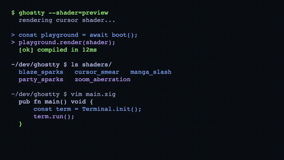 | **cursor_smear_fade_original**<br>[`shaders/cursor_smear_fade_original.glsl`](shaders/cursor_smear_fade_original.glsl) |
| 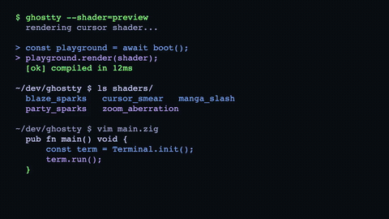 | **cursor_smear_gradient_original**<br>[`shaders/cursor_smear_gradient_original.glsl`](shaders/cursor_smear_gradient_original.glsl) |
| 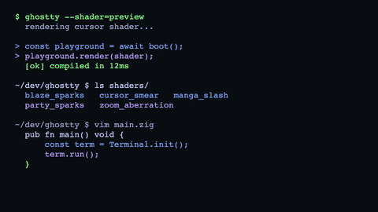 | **cursor_smear_rainbow_original**<br>[`shaders/cursor_smear_rainbow_original.glsl`](shaders/cursor_smear_rainbow_original.glsl) |

</details>

### Blaze

| Preview | Shader |
| --- | --- |
| 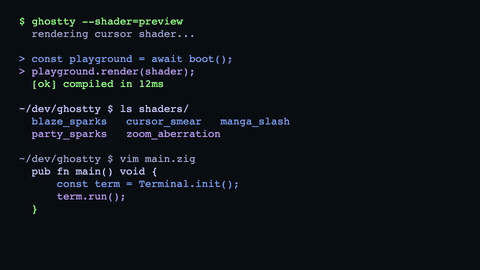 | **cursor_blaze** — Fiery blaze trail behind the cursor.<br>[`shaders/cursor_blaze.glsl`](shaders/cursor_blaze.glsl) |
|  | **cursor_blaze_tapered** — Blaze that tapers to a point.<br>[`shaders/cursor_blaze_tapered.glsl`](shaders/cursor_blaze_tapered.glsl) |
| 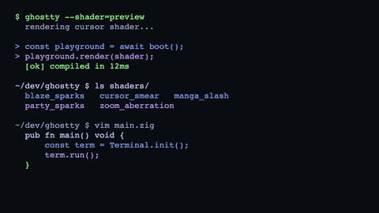 | **cursor_blaze_no_trail** — Blaze glow with no lingering trail.<br>[`shaders/cursor_blaze_no_trail.glsl`](shaders/cursor_blaze_no_trail.glsl) |
|  | **blaze_sparks** — Blaze trail that throws off sparks.<br>[`shaders/blaze_sparks.glsl`](shaders/blaze_sparks.glsl) |

### Sparks

| Preview | Shader |
| --- | --- |
|  | **sparks** — Sparks emitted as the cursor moves.<br>[`shaders/sparks.glsl`](shaders/sparks.glsl) |
| 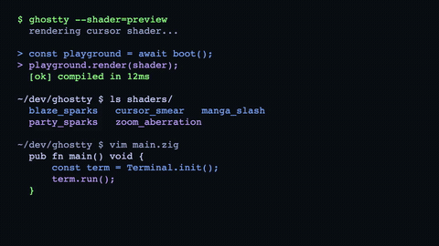 | **party_sparks** — Colorful, celebratory spark burst.<br>[`shaders/party_sparks.glsl`](shaders/party_sparks.glsl) |

### Matrix / code rain

> Green "digital rain" triggered by typing. Their previews are rendered with the
> cursor low on screen so you can see the drops fall in the space above it.

| Preview | Shader |
| --- | --- |
|  | **matrix_rain** — Each keystroke drops a slow stream of random ASCII glyphs from a random height in the cursor's column; bright head, trail fading up.<br>[`shaders/matrix_rain.glsl`](shaders/matrix_rain.glsl) |
| 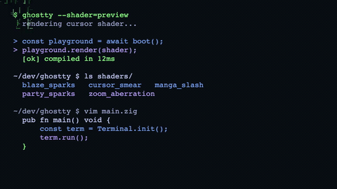 | **raindrop_neo** — "Neo": cursor-triggered green code rain in the cursor column and the columns trailing behind it (doesn't read terminal text).<br>[`shaders/raindrop_neo.glsl`](shaders/raindrop_neo.glsl) |
|  | **raindrop_neo2** — Bigger, clustered code rain with randomized per-column delay, speed, height, and phase.<br>[`shaders/raindrop_neo2.glsl`](shaders/raindrop_neo2.glsl) |
| 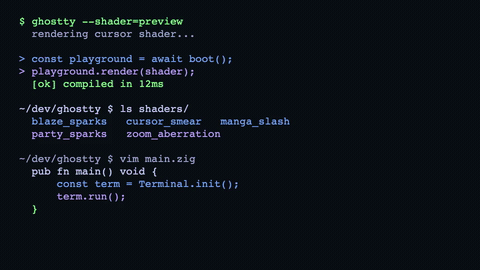 | **sparkle_neo** — Calm green sparkle burst that flares near the cursor on movement, then fades.<br>[`shaders/sparkle_neo.glsl`](shaders/sparkle_neo.glsl) |

### Manga

| Preview | Shader |
| --- | --- |
| 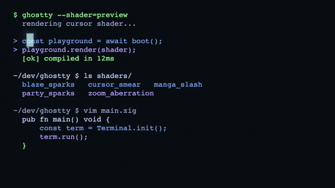 | **manga_slash** — Manga-style water-flow slash drawn between cursor positions. _(by Komsit37)_<br>[`shaders/manga_slash.glsl`](shaders/manga_slash.glsl) |
| 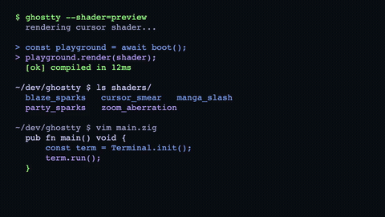 | **manga_blaze** — Manga slash that only fires on larger cursor jumps. _(by Komsit37)_<br>[`shaders/manga_blaze.glsl`](shaders/manga_blaze.glsl) |
| 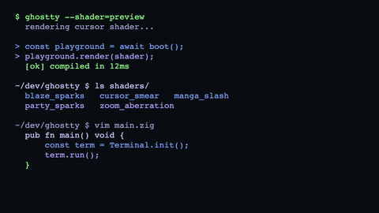 | **manga_blaze_fire** — Manga blaze, fiery-orange palette.<br>[`shaders/manga_blaze_fire.glsl`](shaders/manga_blaze_fire.glsl) |
| 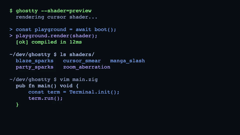 | **manga_blaze_blue** — Manga blaze, blue palette.<br>[`shaders/manga_blaze_blue.glsl`](shaders/manga_blaze_blue.glsl) |
| 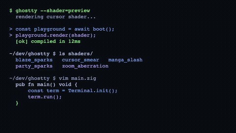 | **manga_blaze_white** — Manga blaze, white palette.<br>[`shaders/manga_blaze_white.glsl`](shaders/manga_blaze_white.glsl) |
| 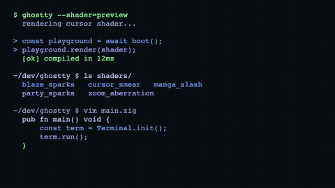 | **manga_blaze_terminal_green** — Manga blaze, terminal-green palette.<br>[`shaders/manga_blaze_terminal_green.glsl`](shaders/manga_blaze_terminal_green.glsl) |

### Ripple / Boom

> These trigger on **cursor shape changes** (e.g. block ↔ bar, like switching
> in/out of insert mode). The previews force a few shape changes so you can see
> them fire.

| Preview | Shader |
| --- | --- |
| 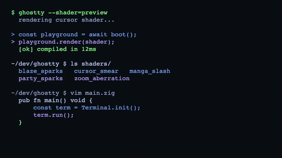 | **ripple_cursor** — Expanding ring ripple on shape change.<br>[`shaders/ripple_cursor.glsl`](shaders/ripple_cursor.glsl) |
|  | **ripple_rectangle_cursor** — Rectangular ripple variant.<br>[`shaders/ripple_rectangle_cursor.glsl`](shaders/ripple_rectangle_cursor.glsl) |
| 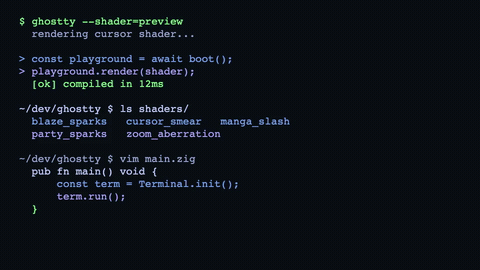 | **rectangle_boom_cursor** — Rectangular shockwave "boom".<br>[`shaders/rectangle_boom_cursor.glsl`](shaders/rectangle_boom_cursor.glsl) |
| 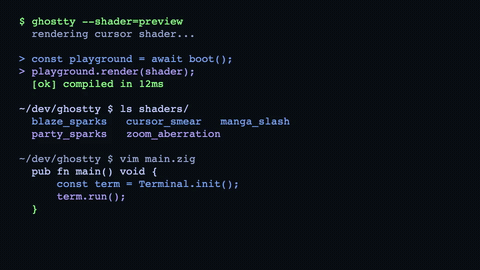 | **sonic_boom_cursor** — Circular sonic-boom shockwave.<br>[`shaders/sonic_boom_cursor.glsl`](shaders/sonic_boom_cursor.glsl) |

### Zoom

| Preview | Shader |
| --- | --- |
| 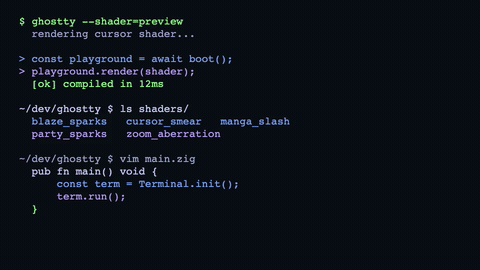 | **last_letter_zoom** — Zooms in on the most recently typed letter.<br>[`shaders/last_letter_zoom.glsl`](shaders/last_letter_zoom.glsl) |
| 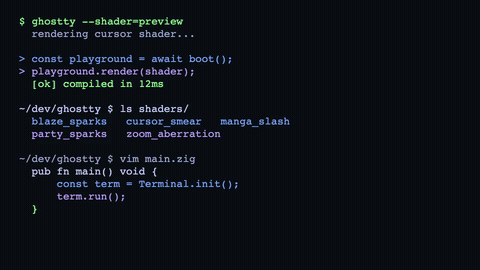 | **zoom_and_aberration** — Zoom punch with chromatic aberration on vertical movement.<br>[`shaders/zoom_and_aberration.glsl`](shaders/zoom_and_aberration.glsl) |

### CRT

| Preview | Shader |
| --- | --- |
| 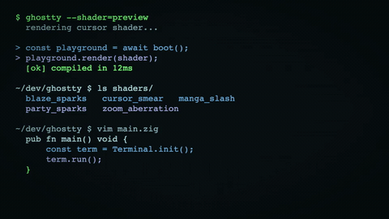 | **crt_green** — Whole-screen CRT look: phosphor-green tint, scanline mask, vignette, soft bloom.<br>[`shaders/crt_green.glsl`](shaders/crt_green.glsl) |
| 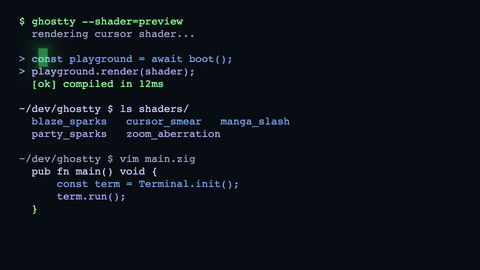 | **crt_cursor** — Restrained green cursor-block blink with a soft glow.<br>[`shaders/crt_cursor.glsl`](shaders/crt_cursor.glsl) |

### Other effects

| Preview | Shader |
| --- | --- |
| 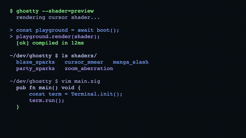 | **cursor_frozen** — Frosty / ice effect around the cursor.<br>[`shaders/cursor_frozen.glsl`](shaders/cursor_frozen.glsl) |
| 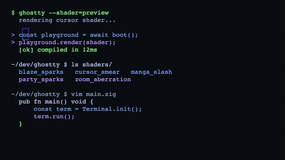 | **cursor_border_1** — Animated outline border around the cursor.<br>[`shaders/cursor_border_1.glsl`](shaders/cursor_border_1.glsl) |
| 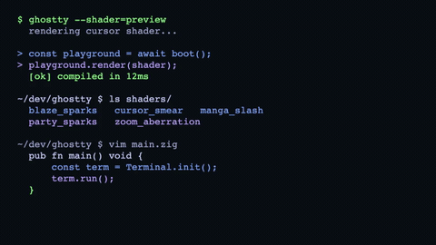 | **shake** — Screen shake on cursor movement.<br>[`shaders/shake.glsl`](shaders/shake.glsl) |

### Debug / dev

> Utility shaders for shader development, not really "effects".

| Preview | Shader |
| --- | --- |
| 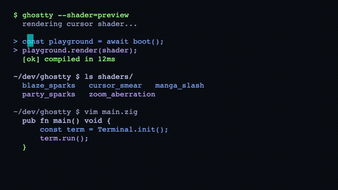 | **debug_cursor_static** — Static visualization of the cursor uniforms.<br>[`shaders/debug_cursor_static.glsl`](shaders/debug_cursor_static.glsl) |
| 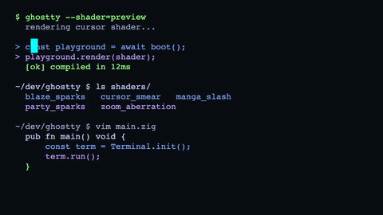 | **debug_cursor_animated** — Animated visualization of the cursor uniforms.<br>[`shaders/debug_cursor_animated.glsl`](shaders/debug_cursor_animated.glsl) |
|  | **test** — Scratch / testing shader.<br>[`shaders/test.glsl`](shaders/test.glsl) |
| 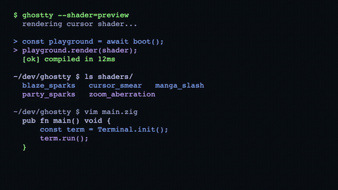 | **WIP** — Work-in-progress shader.<br>[`shaders/WIP.glsl`](shaders/WIP.glsl) |

---

## Notes on compatibility fixes

A few shaders were written for desktop Ghostty's GLSL and needed small,
mechanical fixes to compile under WebGL2 / GLSL ES (which is stricter). The
versions in [`shaders/`](shaders/) include these fixes and work in both:

- **`manga_slash`** — a direction vector was normalized with the shader's own
  2-arg coordinate helper; switched to the built-in `normalize()`.
- **`cursor_sweep`, `cursor_tail`, `cursor_warp`, `rectangle_boom_cursor`,
  `ripple_cursor`, `ripple_rectangle_cursor`, `sonic_boom_cursor`** — their
  custom `normalize(value, isPosition)` helper was renamed to `normalizeCoord`
  (GLSL ES forbids redeclaring built-ins), and a non-constant global
  initializer was converted to a `#define`.

---

## Credits

These shaders are sourced from / built on:

- **[sahaj-b/ghostty-cursor-shaders](https://github.com/sahaj-b/ghostty-cursor-shaders)**
- **[KroneCorylus/ghostty-shader-playground](https://github.com/KroneCorylus/ghostty-shader-playground)**
- **[Komsit37](https://github.com/komsit37)** — the `manga_slash` / `manga_blaze` family

Huge thanks to the original authors. Please refer to those repositories for
licensing and the canonical versions of each shader. The Matrix/`neo`, `crt_*`,
and `sparkle_neo` shaders are additions in this collection.
